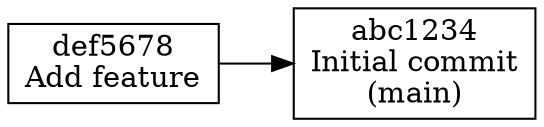
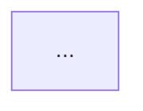

# graph

Visualize the commit DAG (Directed Acyclic Graph) in various formats.

## Synopsis

```bash
rit graph                    # ASCII graph (default)
rit graph --format mermaid   # Mermaid.js format
rit graph --format dot       # DOT format (Graphviz)
rit graph -o graph.mmd       # Output to file
```

## Description

The `graph` command visualizes the entire commit history as a directed acyclic graph (DAG). It shows:

- All commits from all branches
- Commit relationships (parent-child)
- Branch labels
- Merge commits

The command supports multiple output formats for different use cases.

## Options

- `-f`, `--format <format>` - Output format: `ascii`, `mermaid`, or `dot` (default: `ascii`)
- `-o`, `--output <file>` - Write output to a file instead of stdout

## Output Formats

### ASCII Format (Default)

Simple text-based visualization suitable for terminal output:

```
─ abc1234: Initial commit (main)
│ ──→ def5678
── def5678: Add feature
│ ──→ ghi9012
── ghi9012: Fix bug
```

### Mermaid Format

Generates Mermaid.js syntax that can be rendered in Markdown or online:

```mermaid
graph TD
    Cabc123[abc1234: Initial commit<br/>(main)]
    Cdef567[def5678: Add feature]
    Cghi901[ghi9012: Fix bug]
    Cdef567 --> Cabc123
    Cghi901 --> Cdef567
```

### DOT Format

Generates Graphviz DOT format for rendering with `dot` command:



## Examples

### ASCII Graph

```bash
$ rit graph
─ abc1234: Initial commit (main)
│ ──→ def5678
── def5678: Add feature
│ ──→ ghi9012
── ghi9012: Fix bug
```

### Mermaid Graph

```bash
$ rit graph --format mermaid
graph TD
    Cabc123[abc1234: Initial commit<br/>(main)]
    Cdef567[def5678: Add feature]
    Cdef567 --> Cabc123
```

### Save to File

```bash
$ rit graph --format mermaid -o graph.mmd
Graph written to graph.mmd

$ cat graph.mmd
graph TD
    ...
```

### Render with Graphviz

```bash
# Generate DOT format
$ rit graph --format dot -o graph.dot

# Render to PNG
$ dot -Tpng graph.dot -o graph.png
```

## How It Works

1. **Collects all commits**: Traverses all branches starting from `refs/heads/` and HEAD
2. **Builds commit graph**: Reads commit objects and their parent relationships
3. **Assigns levels**: Uses BFS to assign topological levels to commits
4. **Generates visualization**: Formats the graph according to the selected format

### Commit Collection

The graph command:
- Reads all branch references from `refs/heads/`
- Starts traversal from each branch head
- Follows parent links to collect all commits
- Handles merge commits (multiple parents)

### Graph Structure

- **Nodes**: Represent commits with short hash and message
- **Edges**: Show parent-child relationships (point from parent to child)
- **Labels**: Include branch names for branch heads
- **Merge commits**: Special styling in Mermaid/DOT formats

## Use Cases

### Visualize Branch Structure

```bash
$ rit graph --format mermaid -o branches.mmd
```

Then include in documentation:
```markdown

```

### Generate Documentation

```bash
# Create graph for README
$ rit graph --format mermaid -o docs/graph.mmd
```

### Debug Repository Structure

```bash
# Quick ASCII view
$ rit graph
```

## See Also

- [log](log.md) - View commit history
- [branch](branch.md) - Manage branches
- [commit](commit.md) - Create commits

